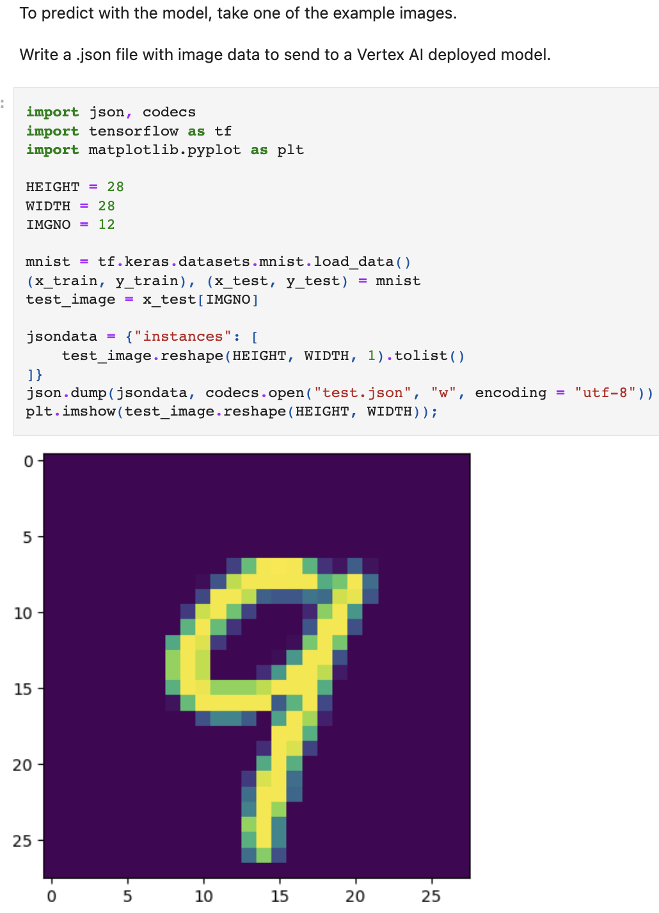

# Advanced_ML_on_Google_Cloud
Notes and exercises for [Advanced Machine Learning on Google Cloud](https://www.coursera.org/specializations/advanced-machine-learning-tensorflow-gcp) Offered by Google Cloud  on Coursera.

## About
This 5-course specialization focuses on advanced machine learning topics using Google Cloud Platform where you will get hands-on experience optimizing, deploying, and scaling production ML models of various types in hands-on labs. 

This specialization picks up where “Machine Learning on GCP” left off and teaches you how to build scalable, accurate, and production-ready models for structured data, image data, time-series, and natural language text. It ends with a course on building recommendation systems.

## Specialization Curriculum
+ ### [Course_1_Production Machine Learning Systems]
+ ### [Course_2_Computer Vision Fundamentals with Google Cloud]
+ ### [Course_3_Natural Language Processing on Google Cloud]
+ ### [Course_4_Recommendation Systems on Google Cloud]

## Explore More
Specialization link: https://coursera.org/share/5e854f74b3d15b627e67d09e316bdb49

## Projects

### 1.Classifying Images with pre-built TF Container on Vertex AI of Google Cloud 

+ Implemented and compared DNN and CNN models for accurate MNIST image classification.
+ Showcased the application of dropout techniques to improve DNN performance.
+ Demonstrated proficiency in deploying and utilizing machine learning models on Vertex AI, enhancing cloud-based deployment expertise.

